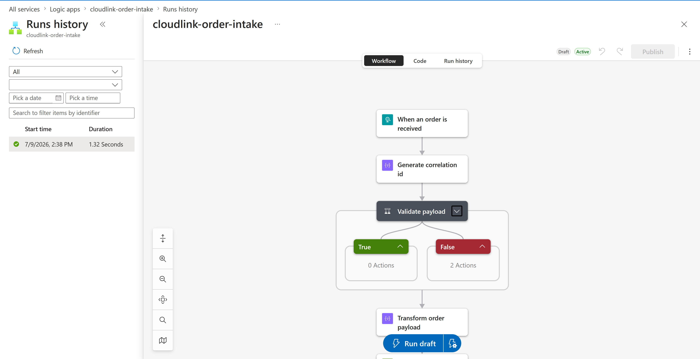
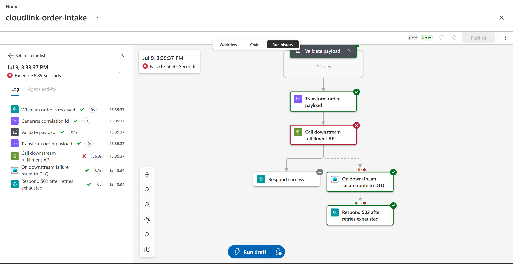

# CloudLink

A production-grade Azure integration: a Logic App receives inbound order events over HTTP, transforms and validates them, calls a downstream fulfillment API, and — on failure — routes the message to a Service Bus dead-letter queue with an alert. Deployed and verified end-to-end on live Azure infrastructure, both the success path and the failure/DLQ path.

Built as a portfolio project for enterprise integration / middleware roles (Azure Logic Apps, Service Bus, API Management, Azure Monitor).

## Why this exists

Most "integration demo" projects stop at the happy path. This one is scoped around what actually gets asked about in an integration-support role: what happens when a message fails, how do you know it failed, where does it end up, and how do you find and fix it. Every piece of failure handling has a matching doc in `/docs` — and, unlike a lot of portfolio projects, every piece has actually been run against real Azure resources, not just designed on paper.

## Architecture

```
Client / Producer
      │  HTTP POST /orders
      ▼
Logic App (cloudlink-order-intake)
      │
      ├─ validate payload
      ├─ transform payload
      ├─ call downstream fulfillment API (App Service) — 4x retry, exponential backoff
      │
      ├─ success ──────────────────────────▶ 200 accepted
      │
      └─ failure (retries exhausted) ──▶ write to Service Bus queue: orders-dlq
                                                    │
                                         Azure Monitor alert rule
                                         (DLQ message count)
                                                    │
                                         On-call notified → runbook
                                                    │
                                         502 routed_to_dlq ──▶ caller
```

Live-verified version of this flow — actual Logic Apps designer, actual run history:



See [`docs/architecture.md`](docs/architecture.md) for the full diagram (Mermaid) and [`docs/dependency-catalog.md`](docs/dependency-catalog.md) for the endpoint/dependency inventory.

## Repo layout

```
cloudlink/
├── infra/                  Terraform: resource group, Service Bus, Logic App, API Connection,
│                            App Service (downstream API host), Monitor alert
├── logic-app/               Logic App workflow definition (ARM-style JSON)
├── downstream-api/         Fulfillment API (FastAPI) — runs locally OR deployed to Azure App Service
├── docs/                   Architecture, API contract, dependency catalog, alert catalog,
│                            runbook, debugging notes, screenshots
└── .github/workflows/      CI: validate Terraform + lint the downstream API
```

## Deployed and verified — what's actually running

This isn't a "should work" project — every path below has been exercised against real Azure infrastructure and confirmed:

**Happy path:** order submitted → validated → transformed → downstream API called → `200 accepted`.

**Failure path:** order submitted → downstream API fails → Logic App retries 4x with exponential backoff (5s → up to 1m) → retries exhausted → message written to `orders-dlq` → `502 routed_to_dlq` returned to caller.


*Actual run history: `Call downstream fulfillment API` failing after retries (56.3s total), `On downstream failure route to DLQ` succeeding, message confirmed present in the queue (`activeMessageCount: 1`).*

## Running it locally (downstream API only — no Azure costs)

The downstream API is a standalone FastAPI service so you can develop and test the Logic App's contract without touching Azure yet.

```bash
cd downstream-api
python -m venv .venv
source .venv/Scripts/activate   # Windows Git Bash; use .venv/bin/activate on macOS/Linux
pip install -r requirements.txt
uvicorn main:app --reload --port 8080
```

Then exercise it (in a second terminal, with the server still running in the first):

```bash
curl -X POST http://localhost:8080/fulfillment \
  -H "Content-Type: application/json" \
  -d '{"order_id": "ord_123", "sku": "WIDGET-1", "qty": 2}'
```

Toggle `SIMULATE_FAILURE_RATE` to test retry/backoff and DLQ routing:

```bash
SIMULATE_FAILURE_RATE=1.0 uvicorn main:app --reload --port 8080
```

## Deploying to Azure

```bash
cd infra
terraform init
terraform plan -var="alert_email=you@example.com"
terraform apply -var="alert_email=you@example.com"
```

This provisions: resource group, Service Bus namespace + `orders` + `orders-dlq` queues, the Logic App shell, a Service Bus API Connection (required for the DLQ-routing action), an App Service hosting the downstream fulfillment API, and a Monitor alert rule on DLQ message count.

> **Region note:** Azure for Students (and other restricted subscriptions) may limit which regions you can deploy to. Check your allowed regions before running `apply`:
> ```bash
> az policy assignment list --output table
> az policy assignment show --name "<policy-name>" --query "parameters.listOfAllowedLocations.value" --output table
> ```
> Override the default with `-var="location=<allowed-region>"` if needed.

### Deploying the workflow logic

Terraform provisions the Logic App shell; the actual workflow definition (trigger, actions, retry policy) is deployed separately, since maintaining one JSON file is more manageable than re-encoding every action as Terraform HCL:

```bash
cd infra
bash deploy-workflow.sh cloudlink-rg cloudlink-order-intake
```

### Deploying the downstream API to Azure

```bash
cd downstream-api
# Windows: use PowerShell's Compress-Archive; zip -r works on macOS/Linux
Compress-Archive -Path main.py, requirements.txt -DestinationPath deploy.zip -Force

az webapp deploy \
  --resource-group cloudlink-rg \
  --name <your-app-service-name> \
  --src-path deploy.zip \
  --type zip
```

Then update `downstreamApiUrl` in `logic-app/workflow.json` to point at the real App Service URL and redeploy the workflow.

> Tear down with `terraform destroy` when not actively demoing — everything here runs on free/low-cost tiers, but it's good practice not to leave it running indefinitely.

## Status

- [x] Downstream API (fulfillment service) with configurable failure injection — running locally **and** deployed to Azure App Service
- [x] Logic App workflow (trigger → validate → transform → call → success/error paths) — deployed and live
- [x] Terraform for resource group, Service Bus, Logic App, API Connection, App Service, Monitor alert
- [x] Service Bus API Connection wired and verified (see debugging notes — this required a real fix)
- [x] End-to-end verified: happy path (`200 accepted`) and failure/DLQ path (`502 routed_to_dlq`, message confirmed in queue)
- [ ] API Management policy (throttling) — see `infra/main.tf` TODO
- [ ] Correlation-ID propagation into downstream logs / centralized log aggregation
- [ ] Load test results

## Docs

- [`docs/architecture.md`](docs/architecture.md) — full diagram + component descriptions
- [`docs/api-contract.yaml`](docs/api-contract.yaml) — OpenAPI spec for the public-facing API
- [`docs/dependency-catalog.md`](docs/dependency-catalog.md) — every endpoint, queue, and dependency
- [`docs/alert-catalog.md`](docs/alert-catalog.md) — what alerts exist, how they route, how to resolve them
- [`docs/runbook-dlq-alert.md`](docs/runbook-dlq-alert.md) — step-by-step incident response for the DLQ alert
- [`docs/debugging-notes.md`](docs/debugging-notes.md) — real issues hit during deployment (region policy restrictions, Service Bus timing, a missing API connection, and two workflow bugs) and how each was diagnosed and fixed