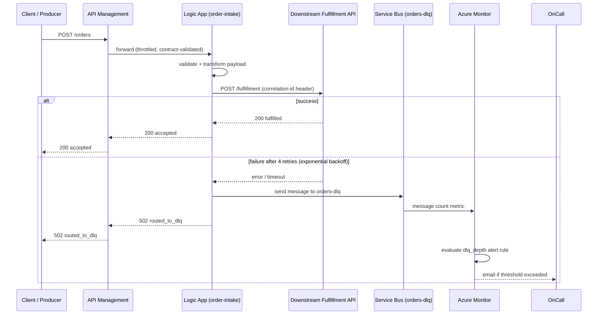

# CloudLink — Architecture

## Diagram

## Components

| Component | Role | Notes |
|---|---|---|
| **API Management** | Public entry point; contract enforcement, throttling | See `docs/api-contract.yaml` |
| **Logic App (order-intake)** | Orchestration: validate → transform → call → error-route | Defined in `logic-app/workflow.json`; retry policy: exponential, 4 attempts, 5s–1m interval |
| **Downstream Fulfillment API** | Backend system of record (mocked for this project) | `downstream-api/main.py`; idempotent on `order_id` |
| **Service Bus — `orders` queue** | Would carry inbound events if this were queue-triggered rather than HTTP-triggered (see "Design decision" below) | System-level DLQ enabled, max delivery count 5 |
| **Service Bus — `orders-dlq` queue** | App-routed dead-letter queue for messages that failed after Logic App retries exhausted | 7-day TTL; independently monitored |
| **Azure Monitor** | Alerting on DLQ depth | See `docs/alert-catalog.md` |

## Design decision: HTTP trigger vs. queue trigger

The Logic App is HTTP-triggered rather than Service-Bus-triggered. This mirrors a common real-world pattern: an upstream system (or APIM) posts synchronously, and the *failure path* — not the intake path — is what needs message-queue durability. The `orders` queue is provisioned for a straightforward extension: swap the HTTP trigger for a Service Bus trigger if the upstream system should be decoupled from Logic App availability.

## Correlation IDs

A correlation ID is generated at the start of every run (`Generate_correlation_id`) and propagated: into the downstream API call header (`x-correlation-id`), into the DLQ message properties, and back to the caller in every response body. This is what lets you take a single ID from a client error and trace it end-to-end through Logic App run history, downstream API logs, and a DLQ message if one exists.

## Known gaps (see README Status)

- API Management throttling policy not yet implemented — TODO in `infra/main.tf`.
- Downstream API logs correlation ID locally but nothing yet ships those logs to Azure Monitor / Log Analytics.
