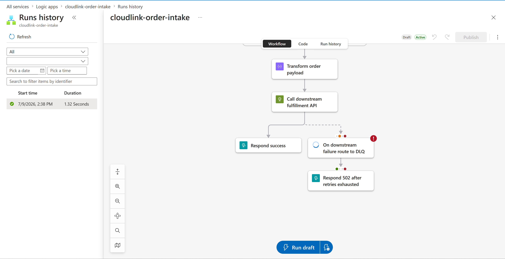
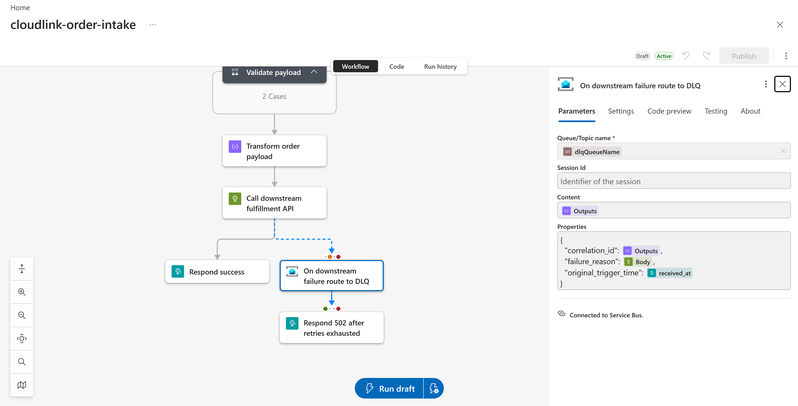
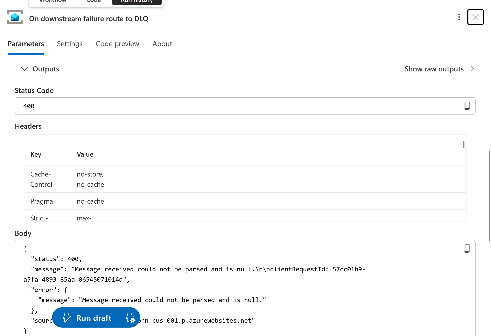

# CloudLink — Debugging Notes

Real issues hit while deploying this project to live Azure infrastructure, how each was diagnosed, and how it was fixed. Written up because "documenting how issues are diagnosed and resolved" is exactly the kind of work this project is meant to demonstrate — and because a project with no visible seams is less honest than one that shows the actual debugging process.

---

## 1. Azure subscription restricted to specific regions

**Symptom:** `terraform apply` failed on both the Service Bus namespace and the Logic App with:
```
RequestDisallowedByAzure: This policy maintains a set of best available regions where
your subscription can deploy resources.
```
This happened on two different regions (`eastus`, then `eastus2`) before finding one that worked.

**Diagnosis:** Azure for Students subscriptions provisioned through a university tenant often have a region-restriction policy applied. Rather than guess region names one at a time, the actual allowed list is queryable directly:
```bash
az policy assignment list --output table
# found: "Allowed resource deployment regions", assignment name "sys.regionrestriction"

az policy assignment show --name "sys.regionrestriction" \
  --query "parameters.listOfAllowedLocations.value" --output table
```
This returned the real list: `westus3`, `northcentralus`, `centralus`, `mexicocentral`, `canadacentral`.

**Fix:** Redeployed with `-var="location=centralus"`, and updated the Terraform variable's default to match so future applies don't need the override.

---

## 2. Service Bus namespace eventual-consistency lag

**Symptom:** Immediately after the Service Bus namespace reported `Creation complete`, the two queue-creation steps failed:
```
ParentResourceNotFound: ... namespace 'cloudlink-sb-j5l0ih' could not be found.
```
A follow-up `terraform apply` then failed differently, this time while just *reading* the namespace's network rule set — also a 404, even though the namespace itself showed `provisioningState: Succeeded` via `az servicebus namespace show`.

**Diagnosis:** Azure's control plane reported the namespace as created before all of its sub-resources (queues, network rule sets) were actually queryable. This is a known class of issue with Service Bus namespaces specifically — the top-level resource "exists" slightly before everything nested under it is reachable.

**Fix:** No configuration change needed — waited a few minutes and re-ran the same `terraform apply`. Confirmed readiness beforehand with a direct query rather than guessing:
```bash
az servicebus namespace network-rule-set show \
  --resource-group cloudlink-rg --namespace-name cloudlink-sb-j5l0ih
```

---

## 3. Terraform state drift on the DLQ queue

**Symptom:** After the timing issue above, a retried `apply` failed with:
```
A resource with the ID ".../queues/orders-dlq" already exists - to be managed via
Terraform this resource needs to be imported into the State.
```

**Diagnosis:** The earlier failed apply had actually succeeded in creating `orders-dlq` on Azure's side *before* the overall apply errored out — but Terraform's local state file never recorded that success, since the error happened before state was written. Azure and Terraform's state had drifted apart.

**Fix:** Rather than deleting and recreating the queue (extra risk against an already-flaky namespace), imported the existing resource into state directly:
```bash
MSYS_NO_PATHCONV=1 terraform import azurerm_servicebus_queue.orders_dlq \
  "/subscriptions/.../resourceGroups/cloudlink-rg/.../queues/orders-dlq"
```
(The `MSYS_NO_PATHCONV=1` prefix was needed separately — Git Bash on Windows rewrites any argument starting with `/` into a Windows filesystem path, which mangled the resource ID on the first attempt.)

---

## 4. Missing Service Bus connection caused a silent DLQ failure

**Symptom:** The Logic App designer flagged the DLQ-routing action with a warning icon before it had even been run:


*The `On downstream failure route to DLQ` action shows a red exclamation icon — Logic Apps' own validation catching a real configuration gap.*

**Diagnosis:** The workflow's DLQ action referenced a Service Bus connection (`@parameters('$connections')['servicebus']['connectionId']`), but no actual Service Bus **API Connection** resource had been created in Azure, and the Logic App had never been deployed with a `$connections` parameter value. The reference pointed at nothing.

**Fix:** Added the connection as a proper Terraform-managed resource, matching the project's IaC-first approach rather than fixing it by hand in the Portal:
```hcl
resource "azurerm_api_connection" "servicebus" {
  name                = "${var.project}-servicebus-connection"
  resource_group_name = azurerm_resource_group.this.name
  managed_api_id      = "/subscriptions/${data.azurerm_client_config.current.subscription_id}/providers/Microsoft.Web/locations/${var.location}/managedApis/servicebus"
  parameter_values = {
    connectionString = azurerm_servicebus_namespace.this.default_primary_connection_string
  }
}
```
Then redeployed the workflow with a `$connections` value pointing at the new connection's resource ID via `az rest` (the `logic` CLI extension's `update` command doesn't expose a way to pass runtime parameter values alongside the definition, so this required a direct ARM API call instead).


*Warning cleared, "Connected to Service Bus" confirmed in the action's configuration panel.*

---

## 5. Two separate bugs in the DLQ message payload

Fixing the connection above made the action *reachable*, but running an actual failure test still failed — a different, more specific problem.

### 5a. Double base64 encoding

**Symptom:** The DLQ-write action failed in ~0.1 seconds (too fast to be a real network call) with:
```json
{
  "status": 400,
  "message": "Message received could not be parsed and is null."
}
```



**Diagnosis:** The workflow wrapped the message content in `@base64(...)` manually. The Service Bus managed connector's "Send message" action handles base64 encoding internally as part of its own transport layer — wrapping it again meant the connector decoded an already-encoded string, got garbage, and rejected it as unparseable.

**First fix attempted:** Removed the manual `@base64(...)` wrapper. Redeployed, re-tested — **same exact error message, unchanged.** This was actually a useful negative result: an identical error before and after a change means that change wasn't the (or wasn't the only) root cause.

### 5b. Nested object passed as a flat message property

**Diagnosis:** Re-examining what stayed constant across both attempts, the `Properties` block set `failure_reason` to `@body('Call_downstream_fulfillment_API')` — a full JSON object (the downstream API's error response), not a flat value. Service Bus message properties are expected to be primitives (strings, numbers, booleans); a nested object likely broke the same parser.

**Fix:** Restored the base64 wrapper (it turned out to be correct all along) and stringified the property value:
```json
"ContentData": "@base64(outputs('Transform_order_payload'))",
"Properties": {
  "failure_reason": "@string(body('Call_downstream_fulfillment_API'))",
  ...
}
```
Redeployed, re-tested with a fresh order ID — confirmed success both in the Logic App run history (green checkmark on the DLQ action) and directly against the Service Bus queue (`activeMessageCount: 1`), rather than trusting the workflow's own generic response message, which — as seen in 5a — reports success/attempted regardless of whether the underlying action actually succeeded.


*Confirmed end-to-end: downstream failure → 4 retries with exponential backoff (56.3s) → DLQ write succeeds → 502 returned to caller.*

---

## What this debugging process demonstrates

- Reading actual error messages and status codes rather than assuming a fix worked based on a generic response.
- Distinguishing "the action reported success" from "the underlying resource actually changed" — verifying against the real Service Bus queue state, not just the workflow's own response body.
- Treating an unchanged error after a change as a real signal (ruling out a hypothesis) rather than noise.
- Fixing infrastructure gaps through Terraform rather than ad hoc Portal changes, keeping the fix reproducible and documented as code.
